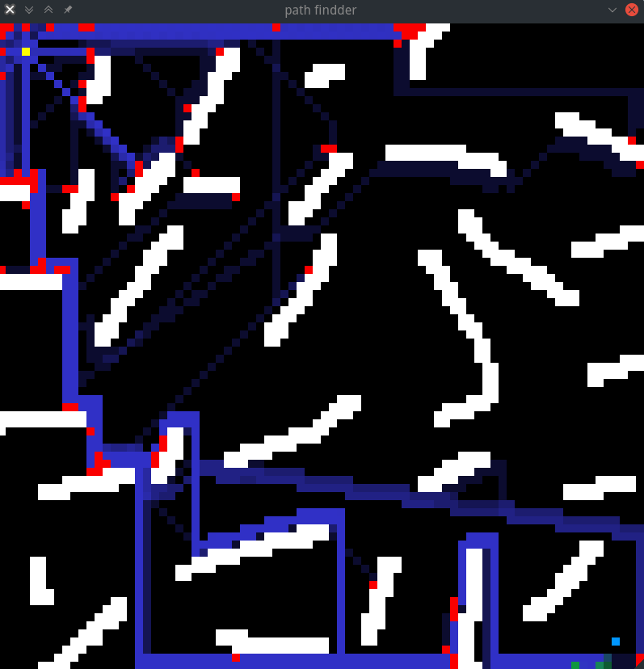
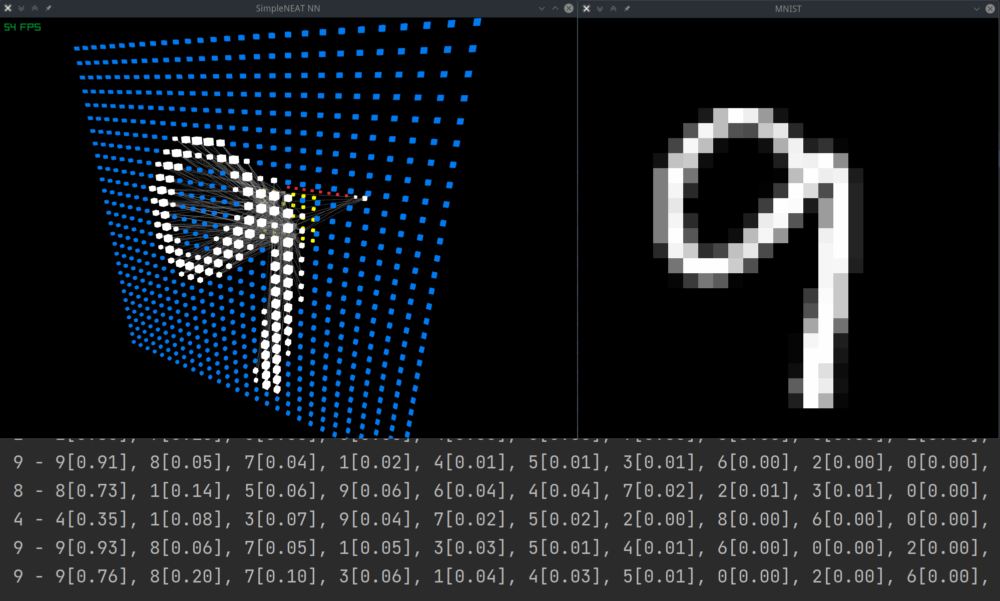

# simpleNEAT

## 致谢

* 两位博士 `Kenneth O. Stanley` 和 `Risto Miikkulainen` [论文链接](https://nn.cs.utexas.edu/downloads/papers/stanley.ec02.pdf)
* 接触是从 [莫烦PYTHON](https://mofanpy.com/)
* 线程池用的 [BS_thread_pool](https://github.com/bshoshany/thread-pool/blob/master/BS_thread_pool.hpp)
* 3D显示用的 `raylib`
* 待补充...

## 描述

* JSF，试着用 `C++` 简单实现 `NEAT` 算法，还没有写种群。

* 没有做过程序员，而且感觉 `C++` 是真的难，实在不会用高级写法。

## 编译

### 显示3d神经网络需要用到 `raylib`

* g++

```bash
g++ -lraylib -std=c++23 -O2 xxx.cpp -o xxx
```

* cmake

```cmake
set(CMAKE_CXX_STANDARD 23)
add_executable(xxx xxx.cpp)
target_link_libraries(xxx raylib)
```

### 不显示3d神经网络需要宏定义 `NO_3DNN`

* g++

```bash
g++ -DNO_3DNN -std=c++23 -O2 xxx.cpp -o xxx
```

* cmake

```cmake
set(CMAKE_CXX_STANDARD 23)
add_executable(xxx xxx.cpp)
target_compile_definitions(xxx PRIVATE NO_3DNN)
```

### 实验

#### xor实验（test_xor.cpp）

输出：
```bash
gen: 1 0x55b6062b9920 3 2 fitness: 0.75
gen: 37 0x55b6062b9b90 4 5 fitness: 0.75001
gen: 40 0x55b6062b9e90 4 5 fitness: 0.75001
gen: 41 0x55b6062b9710 4 5 fitness: 0.75013
gen: 42 0x55b6062b9c50 4 5 fitness: 0.77177
gen: 43 0x55b6062b9890 4 5 fitness: 0.99346
HiddenNeuronInnovations: 1
best: geration:43 fitness 0.99346 neurons 4 connections 5
neurons:
0 1
1 1
3 -1.18196
2 -2.8869
connections:
0 2 4.07129
0 3 -4.53845
1 2 -1.98597
1 3 4.98912
3 2 5.21552
predict:
0 0 [0] 7.7684e-07
1 1 [0] 0.0378004
0 1 [1] 0.842768
1 0 [1] 0.996992
```

可输出神经网络和可视化dot格式图像：


#### 鸢尾花实验（test_iris.cpp）

`Fitness` 达到 `0.979` 的神经网络有 `18` 个神经元和 `111` 条神经连接:


raylib 实时显示神经网络结构


#### 基于 `sfml` 的分类实验（test_classification_sfml.cpp）

两个类型：


三个类型：


四个类型：


以此类推...

#### 基于 `sfml` 的寻路实验（test_pathfindder_sfml.cpp）



对于局部最优解的陷阱还没有找到高效的解决办法，个体会倾向于贴边走...


#### `MNIST` 的全连接神经网络训练与识别（test_train_MNIST_FC.cpp/test_deploy_MNIST.cpp）

训练：
使用 `.csv格式` 的训练集，地址[https://github.com/sbussmann/kaggle-mnist](https://github.com/sbussmann/kaggle-mnist)

```bash
size: 42000
r: 1 i: 0 0.579719
r: 1 i: 1000 0.927157
r: 1 i: 2000 0.940044
r: 1 i: 3000 0.948176
r: 1 i: 4000 0.953082
```

识别：

```bash
0 - 0[0.95], 2[0.04], 8[0.02], 6[0.02], 4[0.02], 7[0.01], 3[0.01], 9[0.01], 5[0.01], 1[0.00], 
9 - 9[0.95], 7[0.03], 3[0.01], 4[0.01], 8[0.01], 5[0.01], 1[0.01], 6[0.00], 2[0.00], 0[0.00], 
6 - 6[0.96], 8[0.03], 4[0.03], 5[0.02], 1[0.02], 9[0.01], 2[0.01], 3[0.00], 0[0.00], 7[0.00], 
0 - 0[0.88], 6[0.08], 3[0.07], 8[0.05], 9[0.05], 5[0.04], 2[0.03], 7[0.01], 4[0.00], 1[0.00], 
6 - 6[0.76], 8[0.52], 5[0.10], 1[0.05], 4[0.02], 0[0.02], 2[0.01], 9[0.00], 3[0.00], 7[0.00], 
8 - 8[0.97], 6[0.07], 9[0.02], 4[0.02], 2[0.02], 5[0.02], 1[0.01], 0[0.01], 3[0.01], 7[0.00], 
4 - 4[0.91], 9[0.06], 8[0.05], 7[0.03], 3[0.02], 1[0.02], 2[0.00], 5[0.00], 6[0.00], 0[0.00], 
3 - 3[0.81], 5[0.07], 1[0.06], 6[0.03], 9[0.02], 8[0.01], 7[0.01], 4[0.00], 2[0.00], 0[0.00], 
1 - 1[0.97], 2[0.02], 5[0.02], 6[0.02], 8[0.01], 9[0.01], 3[0.01], 7[0.01], 4[0.00], 0[0.00], 
7 - 7[0.53], 9[0.38], 8[0.03], 1[0.01], 4[0.00], 6[0.00], 2[0.00], 3[0.00], 5[0.00], 0[0.00], 
9 - 8[0.77], 5[0.15], 9[0.10], 4[0.04], 1[0.02], 3[0.01], 6[0.00], 7[0.00], 2[0.00], 0[0.00], 
5 - 5[0.96], 1[0.03], 6[0.02], 8[0.02], 3[0.01], 4[0.01], 0[0.00], 2[0.00], 7[0.00], 9[0.00], 
6 - 6[0.88], 8[0.11], 1[0.05], 5[0.02], 2[0.01], 9[0.01], 4[0.01], 3[0.00], 0[0.00], 7[0.00], 
4 - 4[0.97], 6[0.04], 9[0.03], 8[0.01], 5[0.01], 7[0.01], 1[0.00], 2[0.00], 0[0.00], 3[0.00], 
4 - 4[0.98], 6[0.03], 9[0.02], 5[0.02], 8[0.02], 7[0.01], 1[0.00], 0[0.00], 2[0.00], 3[0.00], 
1 - 1[0.97], 7[0.02], 2[0.01], 4[0.00], 8[0.00], 6[0.00], 3[0.00], 5[0.00], 9[0.00], 0[0.00],
```


